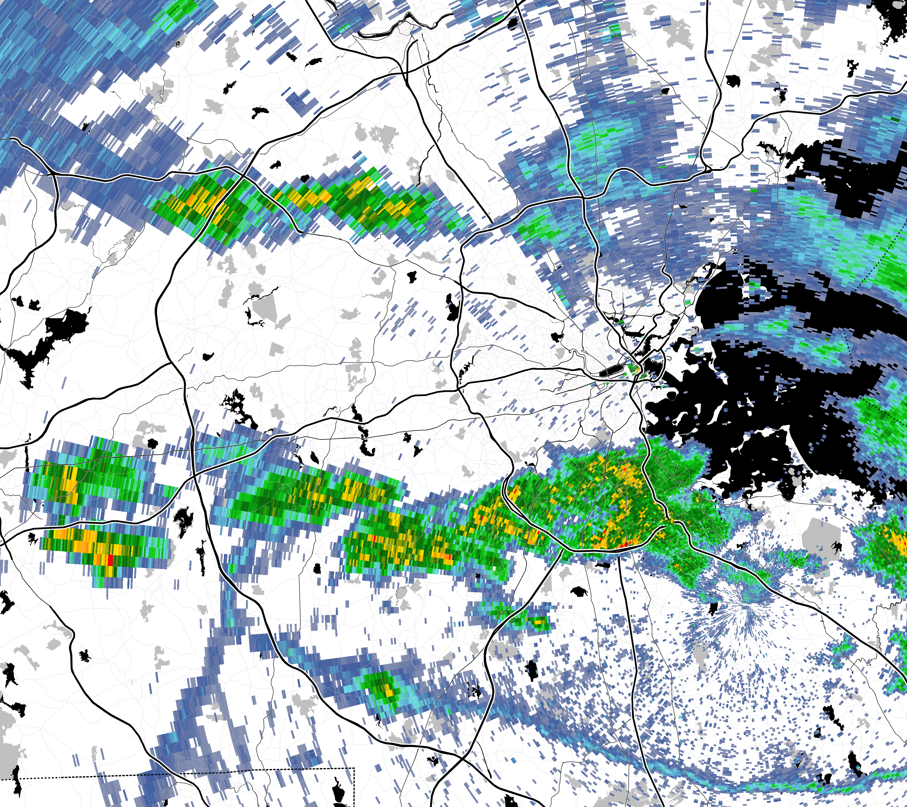

# Mr. Radar

Mr. Radar is a minimalist Python application for rendering radar data
from the National Weather Service of the United States. Radar data is
rendered using the standard NWS color scale, layered with a
user-specified map layer, and saved in png format.

### Radar data

Raw radar files are downloaded from the National Weather Service
FTP server at
[tgftp.nws.noaa.gov](https://www.weather.gov/tg/anonymous).
The NWS provides some documentation about the
[directory structure](https://www.weather.gov/tg/fstandrd) and
[radar file paths](https://www.weather.gov/tg/radfiles).
Notably, high-resolution airport TWDR sources are also available,
whearas most other radar services only use the lower-resolution NEXRAD
data.

There is some variation in the exact path between the various NEXRAD
and TDWR sites, so it is sometimes helpful to poke around the
[directory browser](https://tgftp.nws.noaa.gov/SL.us008001/DF.of/DC.radar/)
until you find your desired site and product.  The most recently uploaded
radar file in each directory is named `sn.last`, and a history of a few
hundred previous uploads is present under the rotating names `sn.0000`,
`sn.0001`, etc.

The [downloaded files](https://www.roc.noaa.gov/WSR88D/BuildInfo/Files.aspx)
are called "Level 3 files" (since they contain
[Level III](https://www.roc.noaa.gov/WSR88D/Level_III/Level3Info.aspx)
radar data), and are natively supported by
[MetPy](https://unidata.github.io/MetPy/latest/api/generated/metpy.io.Level3File.html).
We also use [pyproj](https://pyproj4.github.io/pyproj/stable/) to
convert radar data (which is given in the form of azimuth and distance
from the radar station) into map coordinates.

There are significant differences in the position encoding between
base reflectivity products (e.g. product code `180z0`) and composite
reflectivity products (e.g. product code `p37cr`). Currently we are
unable to render composite reflectivity data.

### Map data

Map data and radar data are rendered using a
[web Mercator](https://en.wikipedia.org/wiki/Web_Mercator_projection)
projection.  As such, map data can be downoaded from nearly any
online map service using the standard
["slippy" tile format](https://wiki.openstreetmap.org/wiki/Slippy_map_tilenames),
including any of the
[tile servers](https://wiki.openstreetmap.org/wiki/Tile_servers)
listed by OpenStreetMap.

Note that map data is rendered *above* radar data, so map tiles must be
mostly transparent in order to avoid obscuring the radar data!  The
[toner-lines](http://maps.stamen.com/toner-lines/)
tiles from Stamen Design work exceptionally well.
(The problem with rendering map data beneath radar data is that you
can't see the map at all when there is a big storm.)

Map tiles are automatically fetched and stitched together into a
single png image on the first call to `mr_radar.py`.  The latitude and
longitude extents of the png image are stored in the png metadata. The
cached map image is *not* automatically refreshed when the URL or
extents are changed; remove `map.png` from the corresponding data
folder whenever it is necessary to regenerate the map.

### Usage

Fill out the `config.ini` file with your desired radar site(s), map
layers, and latitude/longitude extents.  Then call `mr_radar.py`.  The
png files with radar and map data will be placed in named folders
corresponding to the section names in the configuration file.  An
`index.html` file displaying an animated loop of the radar images
will be generated in each folder.

The `make_map.py` and `level3_to_png.py` files are also callable as
standalone utilities.  `make_map.py` downloads and stitches together
map tiles to generate a png map image, and `level3_to_png.py` renders
a level 3 file to a png image over the specified extents.

### Other remarks

It is also possible to project and layer radar and map data using
[cartopy](https://scitools.org.uk/cartopy/docs/latest/).  At first
glance, this seems like a simpler solution, since cartopy has built-in
support for coordinate transforms and map tile stitching.  However, it
ends up being difficult to obtain pixel-accurate output, and the
cartopy documentation leaves something to be desired.  Ultimately I
was able to obtain better results with less effort by calling pyproj
directly, writing my own map tile stitcher, and using PIL to perform
the final layering.

### Future work

* Fetch new images on a schedule.
* Display past and present images in an animated loop.
* More granular control of directory paths and file names.
* Performance profiling and improvements.
* Figure out how to render composite reflectivity.
